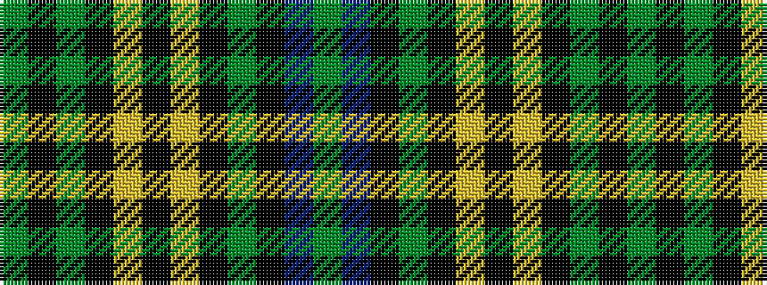

GBKGKYKYKGKG

It is a 12 stripe tartan.

<figure class="pat-woven">

<figcaption>idealised sample</figcaption>
</figure>

## Colour Sequence



## Tartans with this colour sequence

| Tartans |
|---------------|
| [Hopetoun](/setts/s12/g22k4g4k21ly2k4ly2k21g4k2db2g22~x2/)|
||
