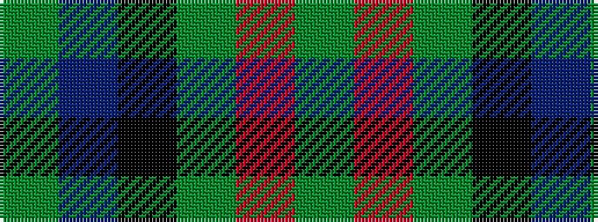

GBKGRG

It is a 6 stripe tartan.

<figure class="pat-woven">

<figcaption>idealised sample</figcaption>
</figure>

## Colour Sequence



## Tartans with this colour sequence

| Tartans |
|---------------|
| [Callum Beg (Fashion)](/variants/s6/g1db6k6g6r1g1~x6/)|
||
