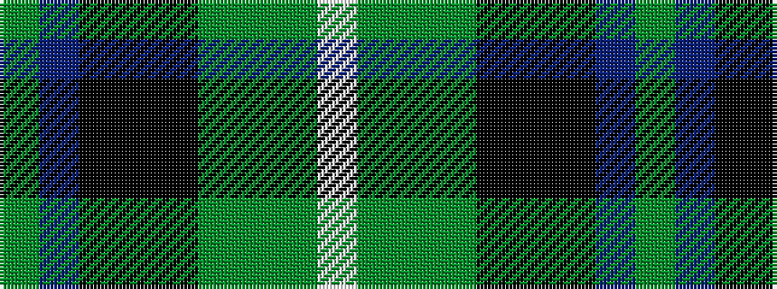

GBKKKGGGW

It is a 9 stripe tartan.

<figure class="pat-woven">

<figcaption>idealised sample</figcaption>
</figure>

## Colour Sequence



## Tartans with this colour sequence

| Tartans |
|---------------|
| [Tombow 21st School Memorial](/setts/s9/dy4db3ki18k3ki2g18dy3g2lb2~x4/)|
||
