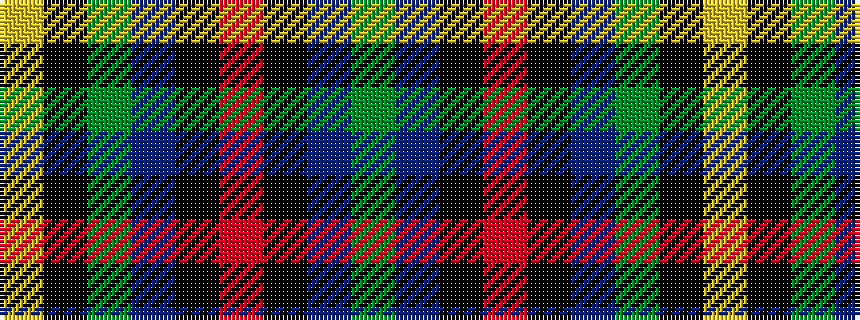

GBKRKBGKY

It is a 9 stripe tartan.

<figure class="pat-woven">

<figcaption>idealised sample</figcaption>
</figure>

## Colour Sequence



## Tartans with this colour sequence

| Tartans |
|---------------|
| [Manroth (Personal)](/setts/s9/dg15db20k2r4k2db20dg15k2ly2~x2/)|
||
