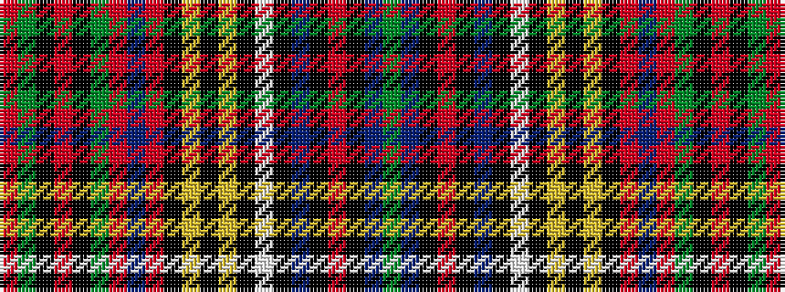

GBKRKBKWKYKYKRBRGKRKGR

It is a 22 stripe tartan.

<figure class="pat-woven">

<figcaption>idealised sample</figcaption>
</figure>

## Colour Sequence



## Tartans with this colour sequence

| Tartans |
|---------------|
| [Anderson (Paton)](/variants/s22/dy6t12k2r3k2t40k6w6k6ly3k3ly3k12r3db12r3dy14k2r3k2dy14r5/)|
||
