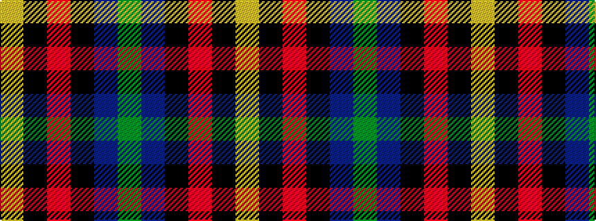

GBKRKY

It is a 6 stripe tartan.

<figure class="pat-woven">

<figcaption>idealised sample</figcaption>
</figure>

## Colour Sequence



## Tartans with this colour sequence

| Tartans |
|---------------|
| [Ferguson, Jeffrey S (Personal)](/variants/s6/dg27db12k12r9k1ly2~x2/)|
||
| [Ferguson, Jerrfey S (Personal)](/variants/s6/g27db12k12r9k1ly2~x2/)|
||
