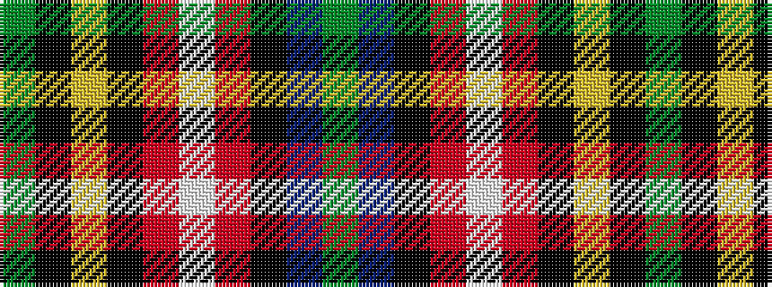

GBKRWRKYKG

It is a 10 stripe tartan.

<figure class="pat-woven">

<figcaption>idealised sample</figcaption>
</figure>

## Colour Sequence



## Tartans with this colour sequence

| Tartans |
|---------------|
| [Scragg Moran (Personal)](/variants/s10/g1dt28k11r5w1r5k11lr1k2g1~x2/)|
||
| [Scragg, Moran (Personal)](/variants/s10/g1b28k11r5w1r5k11ly1k2g1~x2/)|
||
