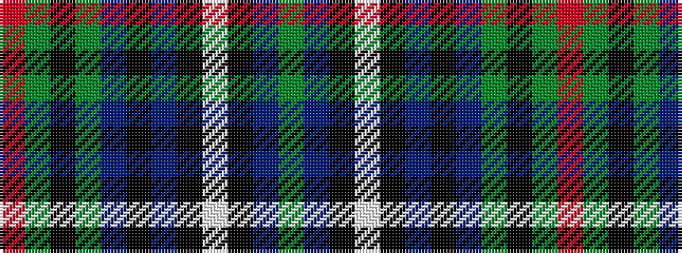

GBKWKBKBGKGR

It is a 12 stripe tartan.

<figure class="pat-woven">

<figcaption>idealised sample</figcaption>
</figure>

## Colour Sequence



## Tartans with this colour sequence

| Tartans |
|---------------|
| [Canmore Highland Games](/variants/s12/g70db3k9w4k4dp4k3db12g9k4g4o4~x2/)|
||
