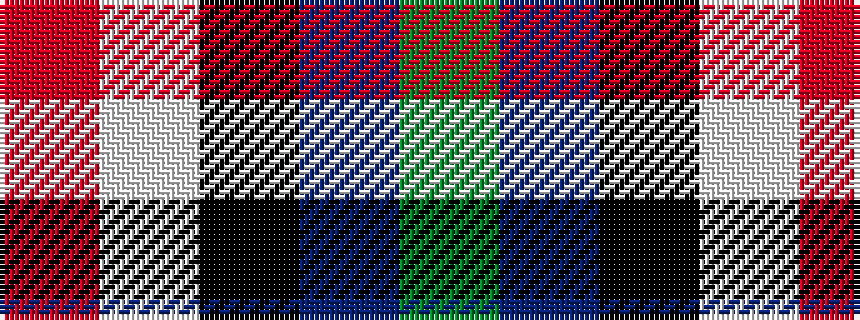

GBKWR

It is a 5 stripe tartan.

<figure class="pat-woven">

<figcaption>idealised sample</figcaption>
</figure>

## Colour Sequence



## Tartans with this colour sequence

| Tartans |
|---------------|
| [Charles-Carberry (Personal)](/variants/s5/dg21t10k26w10r1~x2/)|
||
