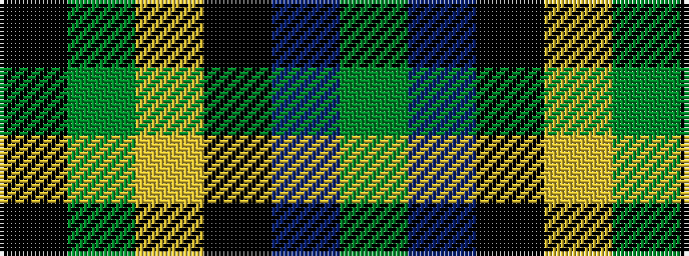

GBKYGK

It is a 6 stripe tartan.

<figure class="pat-woven">

<figcaption>idealised sample</figcaption>
</figure>

## Colour Sequence



## Tartans with this colour sequence

| Tartans |
|---------------|
| [Wilson's No.100](/variants/s6/k3dg17ly2k18dp17dg3~x2/)|
||
| [Wilson's, No 100](/variants/s6/k3g17ly2k18p17g3~x2/)|
||
