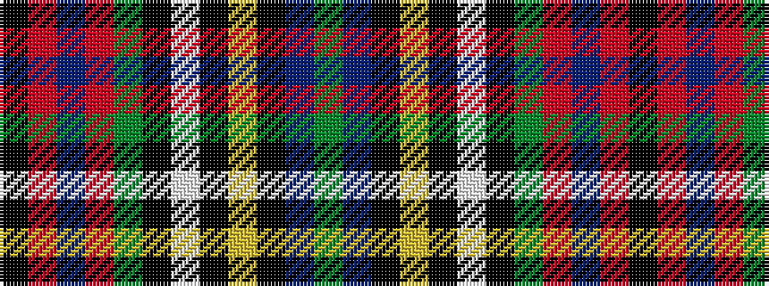

GBKYKWKGRBRK

It is a 12 stripe tartan.

<figure class="pat-woven">

<figcaption>idealised sample</figcaption>
</figure>

## Colour Sequence



## Tartans with this colour sequence

| Tartans |
|---------------|
| [MacLean of Duart](/variants/s12/y9t5k8ly2k4w4k4dg31r50t4r4k3~x2/)|
||
| [MacLean of Duart 6](/variants/s12/y9t5k8ly2k4w4k4g31r50t4r4k3~x2/)|
||
