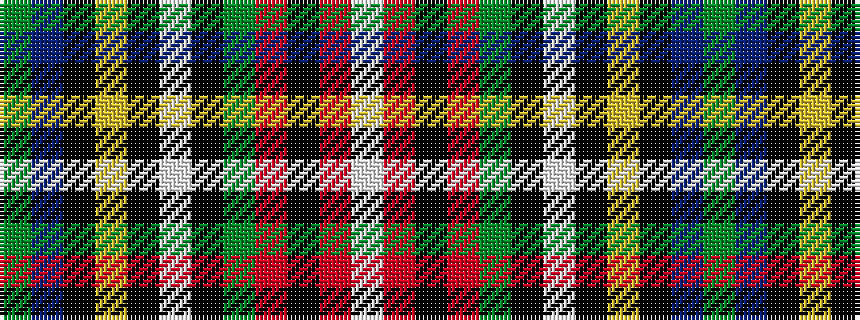

GBKYKWKGRKRW

It is a 12 stripe tartan.

<figure class="pat-woven">

<figcaption>idealised sample</figcaption>
</figure>

## Colour Sequence



## Tartans with this colour sequence

| Tartans |
|---------------|
| [King George VI (Royal)](/setts/s12/g42b3k8ly2k2w3k2g12r5k2r2w2~x2/)|
||
| [Princess Mary](/setts/s12/dg44db3k8ly2k2w2k2dg9r5k2r2w2~x2/)|
||
| [Princess Mary](/setts/s12/g44db3k8ly2k2w2k2g9r5k2r2w2~x2/)|
||
