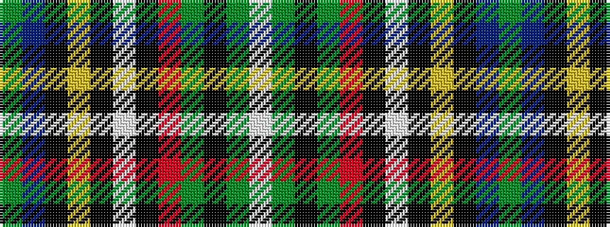

GBKYKWKRGKGW

It is a 12 stripe tartan.

<figure class="pat-woven">

<figcaption>idealised sample</figcaption>
</figure>

## Colour Sequence



## Tartans with this colour sequence

| Tartans |
|---------------|
| [Royal Stewart, (Variant)](/setts/s12/g32t2k7ly1k1w1k2r7g5k1g3w1~x2/)|
||
| [Stuart/Stewart (Variant)](/setts/s12/dg32t2k7ly1k1w1k2r7dg5k1dg3w1~x2/)|
||
