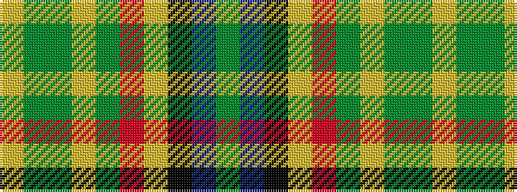

GBKYRGYGGY

It is a 10 stripe tartan.

<figure class="pat-woven">

<figcaption>idealised sample</figcaption>
</figure>

## Colour Sequence



## Tartans with this colour sequence

| Tartans |
|---------------|
| [State Seal of New Hampshire (Fash.)](/setts/s10/g49b6k12lo4r6g29lo4dy16g7lo4~x2/)|
||
