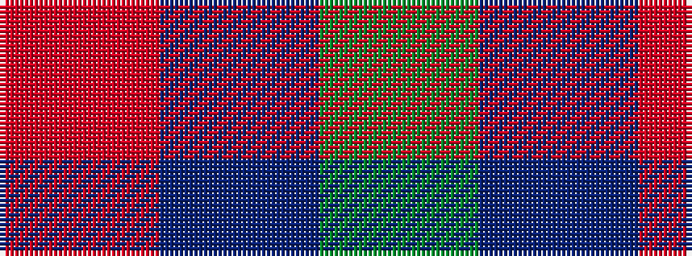

GBR

It is a 3 stripe tartan.

<figure class="pat-woven">

<figcaption>idealised sample</figcaption>
</figure>

## Colour Sequence



## Tartans with this colour sequence

| Tartans |
|---------------|
| [Wilson's No.084](/setts/s3/dg6dp5r1~x4/)|
||
| [Wilson's, No 208](/setts/s3/g7t2r4~x2/)|
||
