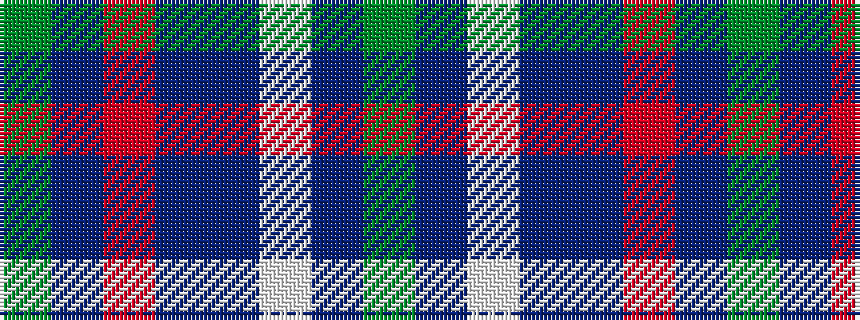

GBRBBWBG

It is a 8 stripe tartan.

<figure class="pat-woven">

<figcaption>idealised sample</figcaption>
</figure>

## Colour Sequence



## Tartans with this colour sequence

| Tartans |
|---------------|
| [Wellmont Golf Tournament](/setts/s8/g24dr2w2dr2dt8o1dr24g4~x2/)|
||
