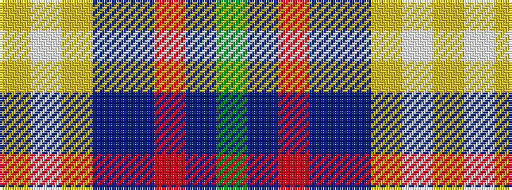

GBRBBYWY

It is a 8 stripe tartan.

<figure class="pat-woven">

<figcaption>idealised sample</figcaption>
</figure>

## Colour Sequence



## Tartans with this colour sequence

| Tartans |
|---------------|
| [Connelly, James (Personal)](/setts/s8/dg12dp6r1dp6dp4ly8w2ly2~x4/)|
||
