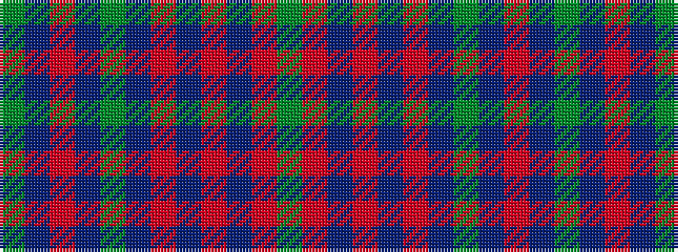

GBRBGBRBRBRG

It is a 12 stripe tartan.

<figure class="pat-woven">

<figcaption>idealised sample</figcaption>
</figure>

## Colour Sequence



## Tartans with this colour sequence

| Tartans |
|---------------|
| [Frame (Ferniegair) (Personal)](/variants/s12/dg4do14r1do1dg1do1r1do14r14do1r1dg1~x4/)|
||
