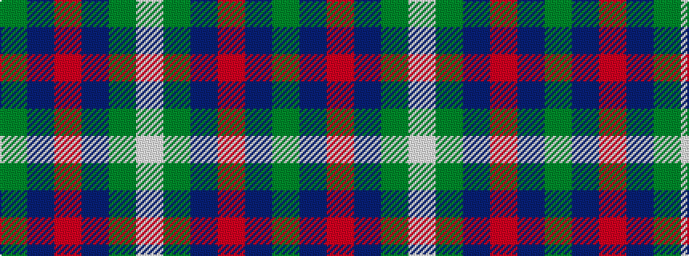

GBRBGW

It is a 6 stripe tartan.

<figure class="pat-woven">

<figcaption>idealised sample</figcaption>
</figure>

## Colour Sequence



## Tartans with this colour sequence

This pattern is a design lineage: every tartan below shares one colour order, whatever its owner —
near-identical designs are grouped, the largest lineage first (#112: the pattern is a tartan's
second parent, beside its family or clan).

<table class="sett-table">
<tbody>
<tr><td><a href="/variants/s6/g34db27r3db27g34w3~x2/">London Regiment (Military)</a></td></tr>
<tr><td class="sett-swatch"></td></tr>
<tr><td><a href="/variants/s6/dg4db12r3db12dg32w4~x2/">MacIntyre</a></td></tr>
<tr><td class="sett-swatch"></td></tr>
<tr><td><a href="/setts/g4db12r3db12g32w4/">MacIntyre L</a></td></tr>
<tr><td class="sett-swatch"></td></tr>
<tr class="cluster-sep"><td></td></tr>
<tr><td><a href="/variants/s6/y15db8r25db72dg98w15/">Afternoon Tea / Darjeeling</a></td></tr>
<tr><td class="sett-swatch"></td></tr>
<tr><td><a href="/variants/s6/w4g28db18r4db18y3~x2/">MacIntyre, Inglis</a></td></tr>
<tr><td class="sett-swatch"></td></tr>
<tr class="cluster-sep"><td></td></tr>
<tr><td><a href="/variants/s6/dy34db27r3db27dy34w3~x2/">London Regiment</a></td></tr>
<tr><td class="sett-swatch"></td></tr>
</tbody>
</table>

