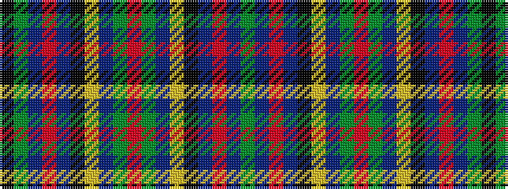

GBRBKYBGRGBYKBRBGK

It is a 18 stripe tartan.

<figure class="pat-woven">

<figcaption>idealised sample</figcaption>
</figure>

## Colour Sequence



## Tartans with this colour sequence

| Tartans |
|---------------|
| [Norwich No.038](/setts/s18/g14t2r3t2k16ly2t16g16r3g16t16ly2k16t2r3t2g14k6~x2/)|
||
