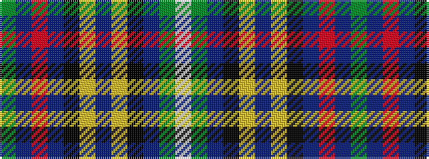

GBRBKYBYKBGW

It is a 12 stripe tartan.

<figure class="pat-woven">

<figcaption>idealised sample</figcaption>
</figure>

## Colour Sequence



## Tartans with this colour sequence

| Tartans |
|---------------|
| [Waipu (District)](/setts/s12/g16db7r2db7k5ly2dp1ly2k5db16g8w1~x2/)|
||
