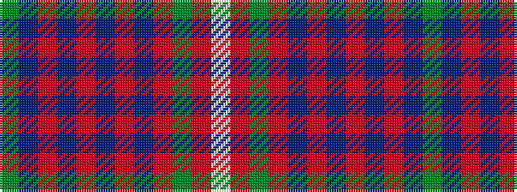

GBRBRBRBRGRW

It is a 12 stripe tartan.

<figure class="pat-woven">

<figcaption>idealised sample</figcaption>
</figure>

## Colour Sequence



## Tartans with this colour sequence

| Tartans |
|---------------|
| [Hand (Personal)](/setts/s12/dg1n8o5n23o5db3o5dp3o5dg5o3w1~x2/)|
||
