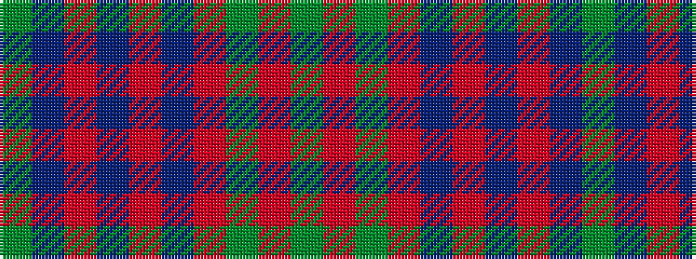

GBRBRBRGRG

It is a 10 stripe tartan.

<figure class="pat-woven">

<figcaption>idealised sample</figcaption>
</figure>

## Colour Sequence



## Tartans with this colour sequence

| Tartans |
|---------------|
| [Connaught (Lochcarron)](/setts/s10/g36t2m2t2m2t2m30dg1m1dg4~x2/)|
||
