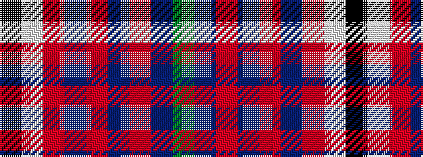

GBRBRBRWK

It is a 9 stripe tartan.

<figure class="pat-woven">

<figcaption>idealised sample</figcaption>
</figure>

## Colour Sequence



## Tartans with this colour sequence

| Tartans |
|---------------|
| [Ormiston (Personal)](/setts/s9/dg26db3r3db20r3db3r30lb3k2~x2/)|
||
