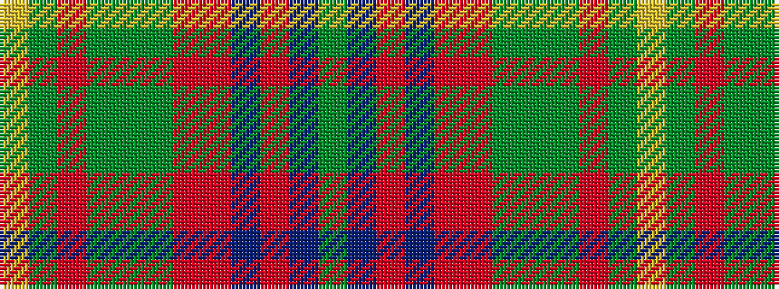

GBRBRRGGGRGY

It is a 12 stripe tartan.

<figure class="pat-woven">

<figcaption>idealised sample</figcaption>
</figure>

## Colour Sequence



## Tartans with this colour sequence

| Tartans |
|---------------|
| [Berry Tribute](/setts/s12/dg43dp3o3dp2o4r3g2dg13g2o9dg1lo2~x2/)|
||
| [Berry Tribute](/setts/s12/gi43dp3o3dp2o4r3g2gi13g2o9gi1lo2~x2/)|
||
