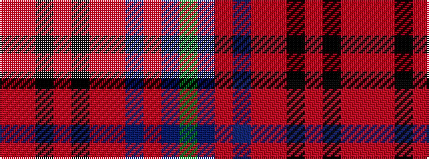

GBRBRRKRKRR

It is a 11 stripe tartan.

<figure class="pat-woven">

<figcaption>idealised sample</figcaption>
</figure>

## Colour Sequence



## Tartans with this colour sequence

| Tartans |
|---------------|
| [Norham and Ladykirk (District)](/setts/s11/dg50db12o7db12r10o7k2o7k2o7r10~x2/)|
||
