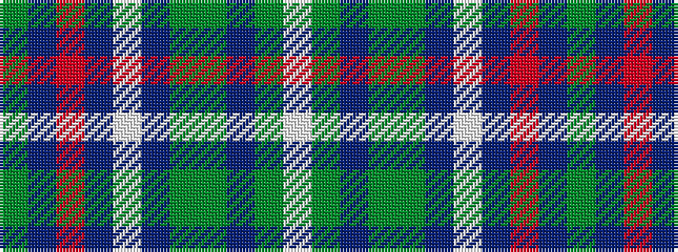

GBRBWBGGBGW

It is a 11 stripe tartan.

<figure class="pat-woven">

<figcaption>idealised sample</figcaption>
</figure>

## Colour Sequence



## Tartans with this colour sequence

| Tartans |
|---------------|
| [Cavalier, Blue](/variants/s11/yi40dt10o2dt2w2dt3y8yi6dt2yi4w2~x2/)|
||
