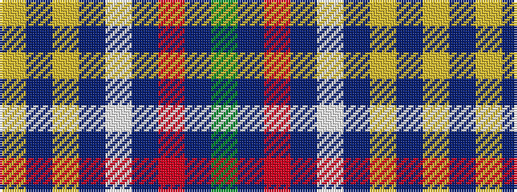

GBRBWBYBY

It is a 9 stripe tartan.

<figure class="pat-woven">

<figcaption>idealised sample</figcaption>
</figure>

## Colour Sequence



## Tartans with this colour sequence

| Tartans |
|---------------|
| [Heart of Strathearn](/setts/s9/g16b6r6b4w2b80lo3b10ly2/)|
||
