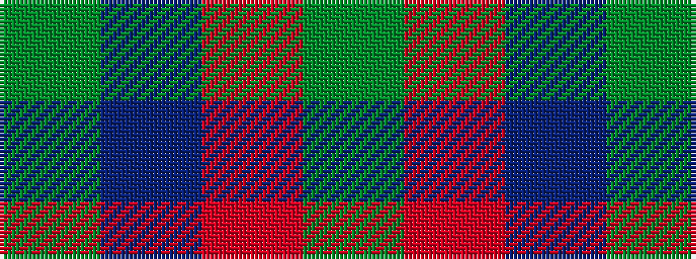

GBRG

It is a 4 stripe tartan.

<figure class="pat-woven">

<figcaption>idealised sample</figcaption>
</figure>

## Colour Sequence



## Tartans with this colour sequence

| Tartans |
|---------------|
| [Stirling of Keir (Clan)](/setts/s4/g1dr10r10g1~x6/)|
||
