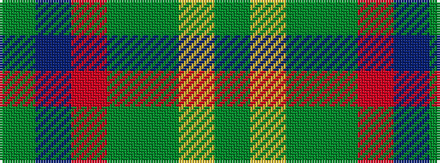

GBRGGYG

It is a 7 stripe tartan.

<figure class="pat-woven">

<figcaption>idealised sample</figcaption>
</figure>

## Colour Sequence



## Tartans with this colour sequence

| Tartans |
|---------------|
| [New Mexico](/variants/s7/g10db42r5dg42g42ly5g10/)|
||
| [New Mexico (Fashion)](/variants/s7/g10dp42r5gi42g42ly5g6/)|
||
