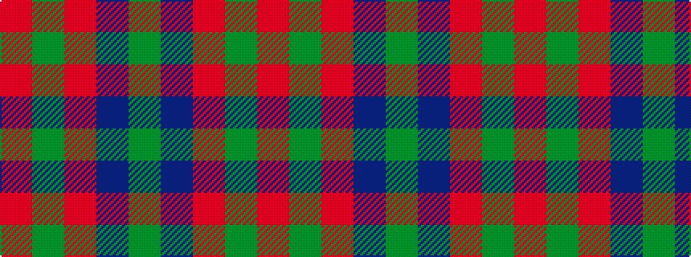

GBRGR

It is a 5 stripe tartan.

<figure class="pat-woven">

<figcaption>idealised sample</figcaption>
</figure>

## Colour Sequence



## Tartans with this colour sequence

| Tartans |
|---------------|
| [Wotherspoon](/variants/s5/r12g8r54db45g6/)|
||
| [Wotherspoon](/variants/s5/r5dg3r18db18dg3~x4/)|
||
