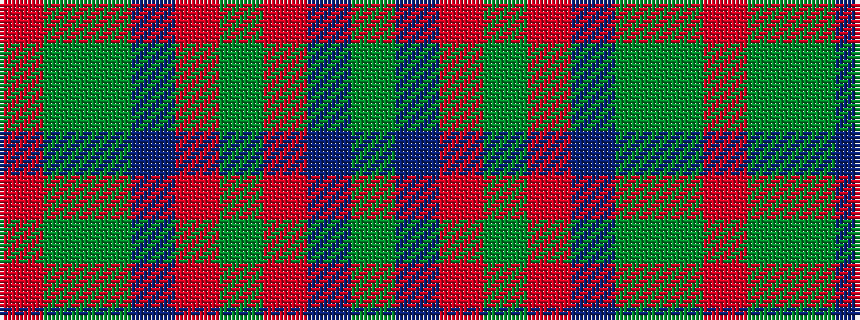

GBRGRBGGR

It is a 9 stripe tartan.

<figure class="pat-woven">

<figcaption>idealised sample</figcaption>
</figure>

## Colour Sequence



## Tartans with this colour sequence

| Tartans |
|---------------|
| [McCall, F W (Personal)](/variants/s9/dg6do2m1dg15m3do1dg15g6m1~x2/)|
||
