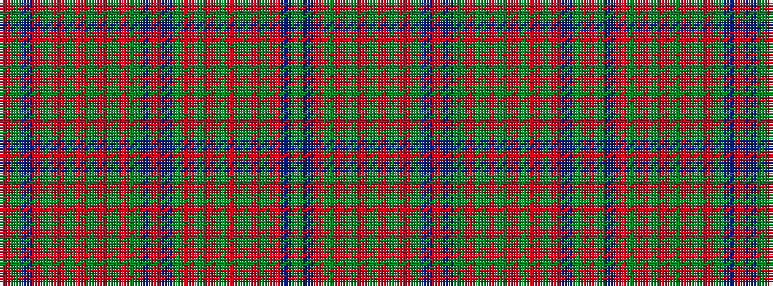

GBRGRGRGRGRGBRBGRGRGRGRGRBGR

It is a 28 stripe tartan.

<figure class="pat-woven">

<figcaption>idealised sample</figcaption>
</figure>

## Colour Sequence



## Tartans with this colour sequence

| Tartans |
|---------------|
| [All Irish Red Irish District Tartan](/variants/s28/r6y2db2r30gi2r2g4r2gi2r1gi20r1y2db2r4~x2/)|
||
