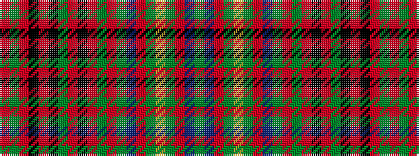

GBRGYGRBGRGRKRGKRKRGR

It is a 21 stripe tartan.

<figure class="pat-woven">

<figcaption>idealised sample</figcaption>
</figure>

## Colour Sequence



## Tartans with this colour sequence

| Tartans |
|---------------|
| [Gordonstoun #3](/variants/s21/r4dg4r1k7r1k1y1r1k7r1dg4r4y1dp4r1dg7ly1dg7r1dp4y1~x4/)|
||
