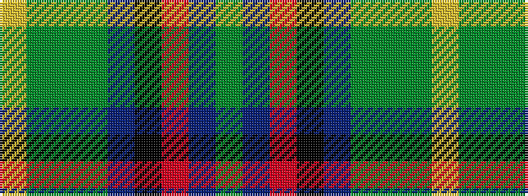

GBRKBGGGY

It is a 9 stripe tartan.

<figure class="pat-woven">

<figcaption>idealised sample</figcaption>
</figure>

## Colour Sequence



## Tartans with this colour sequence

| Tartans |
|---------------|
| [Thistle Stop LLC](/variants/s9/lg16g1gi1g1t24k12m16dp2g2~x2/)|
||
