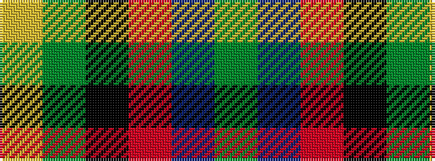

GBRKGY

It is a 6 stripe tartan.

<figure class="pat-woven">

<figcaption>idealised sample</figcaption>
</figure>

## Colour Sequence



## Tartans with this colour sequence

| Tartans |
|---------------|
| [Royal Ashburn Golf Club](/setts/s6/g2b22r2k21g23ly2~x2/)|
||
