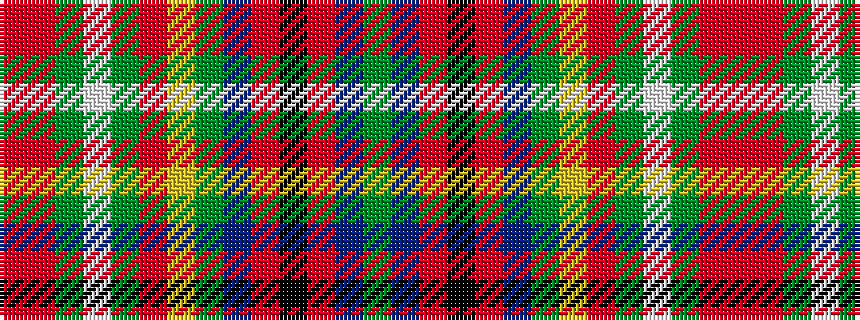

GBRKRBGYRGWGRR

It is a 14 stripe tartan.

<figure class="pat-woven">

<figcaption>idealised sample</figcaption>
</figure>

## Colour Sequence



## Tartans with this colour sequence

| Tartans |
|---------------|
| [Hyndman (Personal)](/setts/s14/g12b5ri2k1ri2b5g12ly3ri12g2w1g2ri12r3~x4/)|
||
