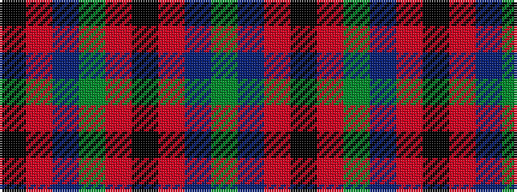

GBRKRGBRK

It is a 9 stripe tartan.

<figure class="pat-woven">

<figcaption>idealised sample</figcaption>
</figure>

## Colour Sequence



## Tartans with this colour sequence

| Tartans |
|---------------|
| [Crook](/setts/s9/k4m14b2y16m3k3m3b12y4~x2/)|
||
