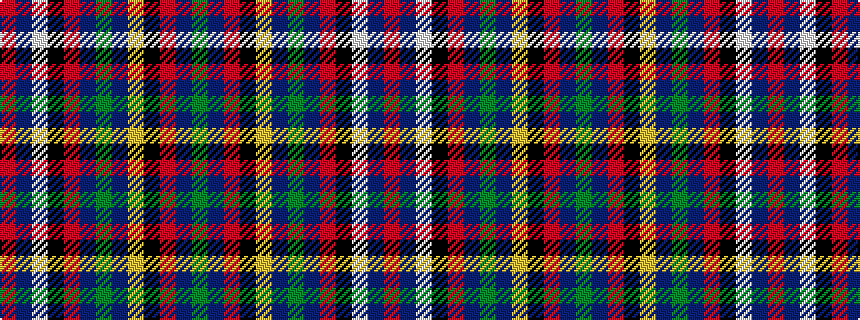

GBRKYBGBRKWBR

It is a 13 stripe tartan.

<figure class="pat-woven">

<figcaption>idealised sample</figcaption>
</figure>

## Colour Sequence



## Tartans with this colour sequence

| Tartans |
|---------------|
| [Olympic](/variants/s13/r24db2w2k2r2db27dg6db2ly2k2r2db2dg23~x2/)|
||
