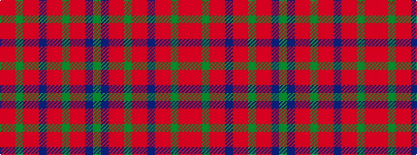

GBRRGRRBRRGRR

It is a 13 stripe tartan.

<figure class="pat-woven">

<figcaption>idealised sample</figcaption>
</figure>

## Colour Sequence



## Tartans with this colour sequence

| Tartans |
|---------------|
| [Ross, David](/variants/s13/o15r2y1r2o15n2o15r2y1r2o15n6g4~x4/)|
||
