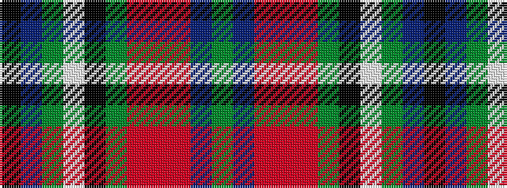

GBRRRGKWGBK

It is a 11 stripe tartan.

<figure class="pat-woven">

<figcaption>idealised sample</figcaption>
</figure>

## Colour Sequence



## Tartans with this colour sequence

| Tartans |
|---------------|
| [Huaumé, Patrick Antoine (Personal)](/variants/s11/g10db9m4r2m4g6k10w4g24db60k4/)|
||
