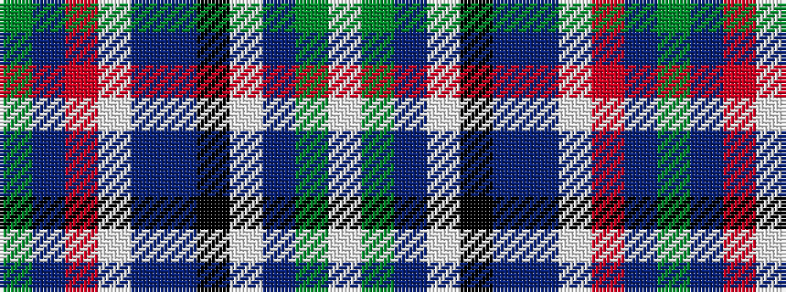

GBRWBBKWBGW

It is a 11 stripe tartan.

<figure class="pat-woven">

<figcaption>idealised sample</figcaption>
</figure>

## Colour Sequence



## Tartans with this colour sequence

| Tartans |
|---------------|
| [Brehat (Personal)](/setts/s11/g30dp4r6w6db6dp3k14w14db50g50w2/)|
||
