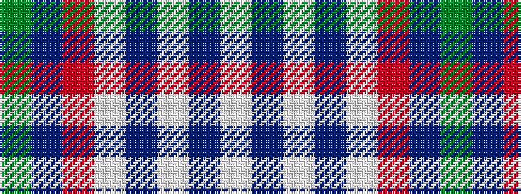

GBRWBWBW

It is a 8 stripe tartan.

<figure class="pat-woven">

<figcaption>idealised sample</figcaption>
</figure>

## Colour Sequence



## Tartans with this colour sequence

| Tartans |
|---------------|
| [Culloden, Red (dress)](/setts/s8/g16p8r45w6p45w44p6w12/)|
||
