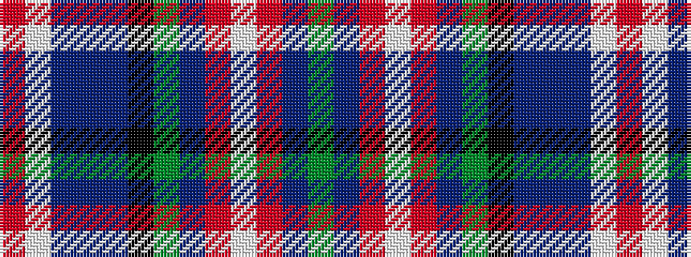

GBRWRBGKBBBWR

It is a 13 stripe tartan.

<figure class="pat-woven">

<figcaption>idealised sample</figcaption>
</figure>

## Colour Sequence



## Tartans with this colour sequence

| Tartans |
|---------------|
| [Twenty First Century](/variants/s13/g12db3o3w2o3db3g5k8db31t5db8w4r6~x2/)|
||
