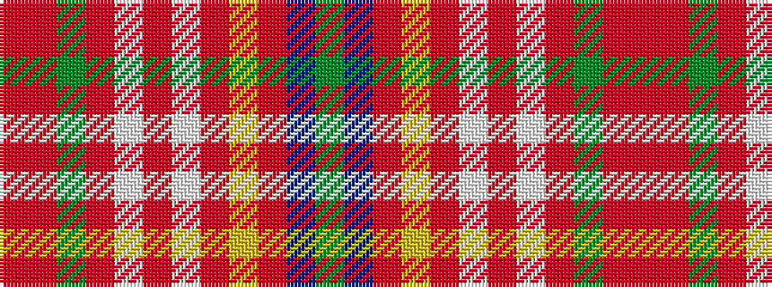

GBRYRWRWRGRR

It is a 12 stripe tartan.

<figure class="pat-woven">

<figcaption>idealised sample</figcaption>
</figure>

## Colour Sequence



## Tartans with this colour sequence

| Tartans |
|---------------|
| [MacLean of Duart, dress](/variants/s12/y12n2o4ly2o3w3o3w19r30y2r4o2~x2/)|
||
