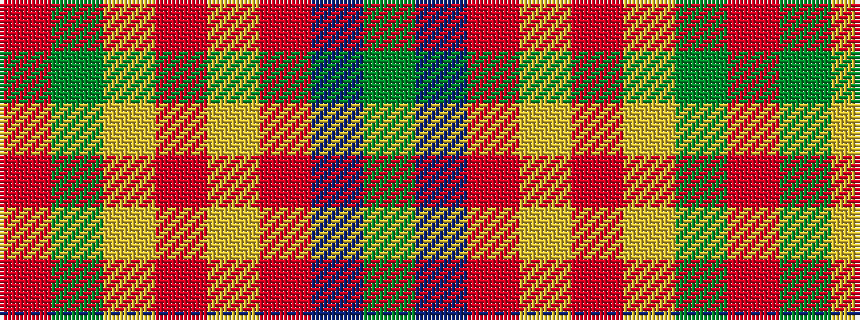

GBRYRYGR

It is a 8 stripe tartan.

<figure class="pat-woven">

<figcaption>idealised sample</figcaption>
</figure>

## Colour Sequence



## Tartans with this colour sequence

| Tartans |
|---------------|
| [State Seal of Nevada (Fashion)](/setts/s8/o49y13lo4o12loi10oi23b13dy3~x2/)|
||
