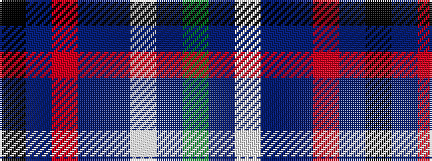

GBWBBRBK

It is a 8 stripe tartan.

<figure class="pat-woven">

<figcaption>idealised sample</figcaption>
</figure>

## Colour Sequence



## Tartans with this colour sequence

| Tartans |
|---------------|
| [Longhaugh Primary School](/setts/s8/g20db2w2db12dp29r1dp1k3~x2/)|
||
