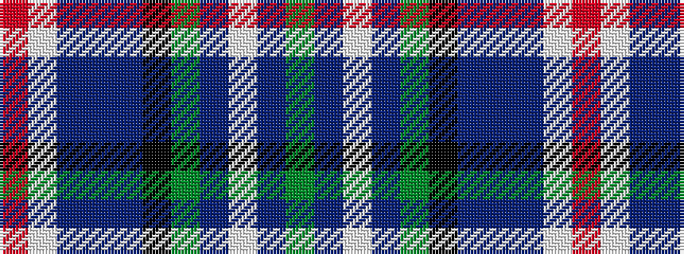

GBWBGKBBBWR

It is a 11 stripe tartan.

<figure class="pat-woven">

<figcaption>idealised sample</figcaption>
</figure>

## Colour Sequence



## Tartans with this colour sequence

| Tartans |
|---------------|
| [New Millennium](/variants/s11/r4lb3db6b4db24k6g4db2lb23db23g4~x2/)|
||
