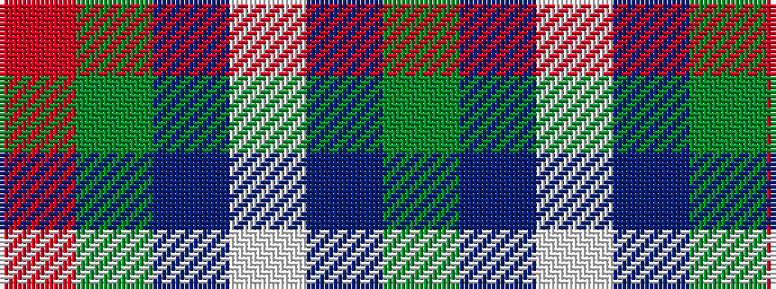

GBWBGR

It is a 6 stripe tartan.

<figure class="pat-woven">

<figcaption>idealised sample</figcaption>
</figure>

## Colour Sequence



## Tartans with this colour sequence

| Tartans |
|---------------|
| [Bronte House Check (Fashion)](/setts/s6/r10dy60dt13lb24dt24dy8/)|
||
| [Wilson's No.113](/setts/s6/g3dp3w1dp3g3r1~x4/)|
||
