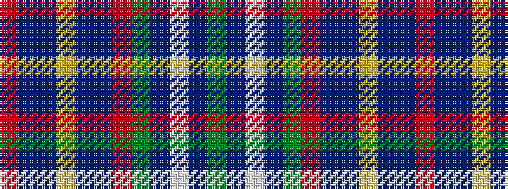

GBWBGRBBYBBR

It is a 12 stripe tartan.

<figure class="pat-woven">

<figcaption>idealised sample</figcaption>
</figure>

## Colour Sequence



## Tartans with this colour sequence

| Tartans |
|---------------|
| [Roslin Roseline Da Vinci](/setts/s12/g6db3w1db3g6r2db15dp60lo2dp30db15r2~x2/)|
||
| [Roslin Roseline Da Vinci (Corporate)](/setts/s12/g6db3w1db3g6r2db15b60lo2b30db15r2~x2/)|
||
